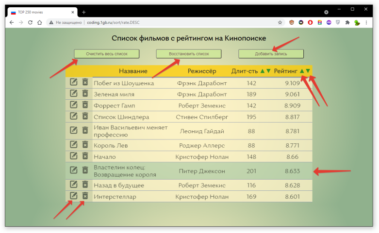

## Курсовой проект

[Методическое пособие по курсовому проектированию](https://pcoding.ru/pdf/CourseProject.pdf)  
Особое внимание в Методическом пособии обратите на Приложение 3.

В текущей папке лежит документ с Титулом (1 лист курсовика, заполняете вы) и Рецензией (последний лист курсовика, заполняет преподаватель).  

Что вы должны выполнить в рамках Курсового проектирования:  
1) работоспособную программную реализацию  
2) "бумажную" версию отчёта о курсовом проектировании, как описано в Методическом пособии  
3) загрузить на git выполненную программную реализацию и Отчёт о КП в формате *.docx  
--(*при проверках, аккредитации иногда приходится переделывать ваши Отчёты под требования*)  

Учебные видео в помощь:  
[Жадный алгоритм MySQL WorkBench MetroStyle C#](https://youtu.be/ThsrS96wBnc)  
[Проект MySQL C# WorkBench phpMyAdmin](https://youtu.be/Y9sIPmtrLnQ)  
[SQLite + CSV + запросы многие ко многим](https://youtu.be/K1EqyVOkv70)  

---  

[Вход в ваш аккаунт на хостинге универа](http://pgsha.ru:35080/phpmyadmin)  

```
MySQL версии 8.0.19

Общие для всех настройки:
Хост: pgsha.ru
Порт: 35006
Use SSL: No

Можно заходить как через WorkBench, 
так и через phpMyAdmin - http://pgsha.ru:35080/phpmyadmin

Индивидуальные:
Username: ********
Password: ********

Логин и пароль получить у преподавателя  
```

Внимание: можно в качестве курсового проекта сдать web-приложение на Node.js + Express.  
За основу можно взять [лабраб-06](https://github.com/permCoding/nodejs21/tree/main/LABRAB/LABRAB06)  

Примерный вид приложения можно оценить тут: http://coding.1gb.ru/  
И тут:  
  

---  
