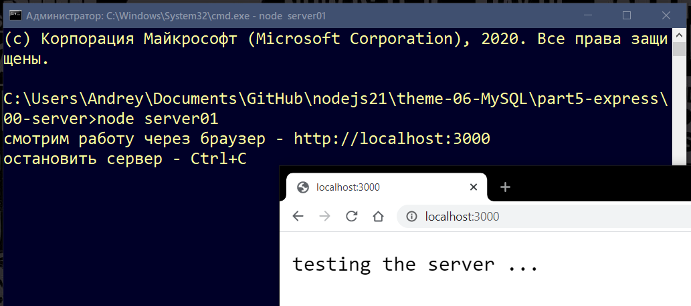

# Library mysql2

## Директория part5-express - рендеринг web-страниц  

В данной директории приведены примеры программ по выводу данных на web-страницу и организации работы с данными из базы данных MySQL через Node.js и Express.  

## Директория 00-server  

Организация сервера средствами Node.js.  

Итак, ранее мы делали программы консольные, теперь попробуем выводить результаты на html-страницу в браузере.  

---  

### server01.js  

```js
const http = require("http"); // модуль http есть по умолчанию

http.createServer((request, response) => {
    response.end("testing the server ...");
}).listen(3000, "127.0.0.1", () => {
    console.log("смотрим работу через браузер - http://localhost:3000");
    let isWin = process.platform === "win32";
    let hotKeys = isWin? "Ctrl+C": "Ctrl+D"; // Windows or Linux
    console.log(`остановить сервер - ${hotKeys}`);
});
```

Попробуйте создать и запустить на исполнение из консоли программу server01.js. После запуска вы увидите служебное сообщение в консоли и ссылку - перейдите по ней или просто в адресной строке браузера наберите адрес http://localhost:3000 и перейдите по этому адресу. Откроется web-страница с сообщением "testing the server ...". 

  

Остановить работу сервера можно сочетанием клавиш "Ctrl+C" или "Ctrl+D" (зависит от операционной системы). Если такую программу запустить на хостинге с Node.js, то она станет доступна и другим пользователям через браузер.  

---  

Теперь сделаем немного посложнее - данные для отображения на web-странице будут браться из текстового файла.  

### server02.js  

```js
const http = require("http");
const fs = require('fs');

const server = http.createServer((req, res) => {
    res.writeHead(200, {'Content-Type': 'text/plain'});
    let myReadStream = fs.createReadStream('./block.txt', 'utf8');
    myReadStream.pipe(res);
});

server.listen(3000, "127.0.0.1", () => {
    console.log("смотрим работу через браузер - http://localhost:3000");
    let isWin = process.platform === "win32";
    let hotKeys = isWin? "Ctrl+C": "Ctrl+D"; // Windows or Linux
    console.log(`остановить сервер - ${hotKeys}`);
});
```

Остановите предыдущую запущенную программу и запустите новую server02.js - в браузере отобразится содержимое текстового файла.  

---  

Для отображения структурированного файла с html разметкой следует изменить тип контента - 'Content-Type': 'text/html':  

### server03.js  

```js
const fs = require('fs');
const http = require("http");

var server = http.createServer((request, response) => {
    response.writeHead(200, {'Content-Type': 'text/html'});
    let myReadStream = fs.createReadStream('./block.html', 'utf8');
    myReadStream.pipe(response);
});

server.listen(3000, "127.0.0.1", () => {
    console.log("смотрим работу через браузер - http://localhost:3000");
    let isWin = process.platform === "win32";
    let hotKeys = isWin? "Ctrl+C": "Ctrl+D"; // Windows or Linux
    console.log(`остановить сервер - ${hotKeys}`);
});
```


## 01-express  
Организация сервера средствами Node.js и Express.  


## 02-express  
Организация рендеринга страницы  

## 03-express  
Расширение функционала  

```txt

```
